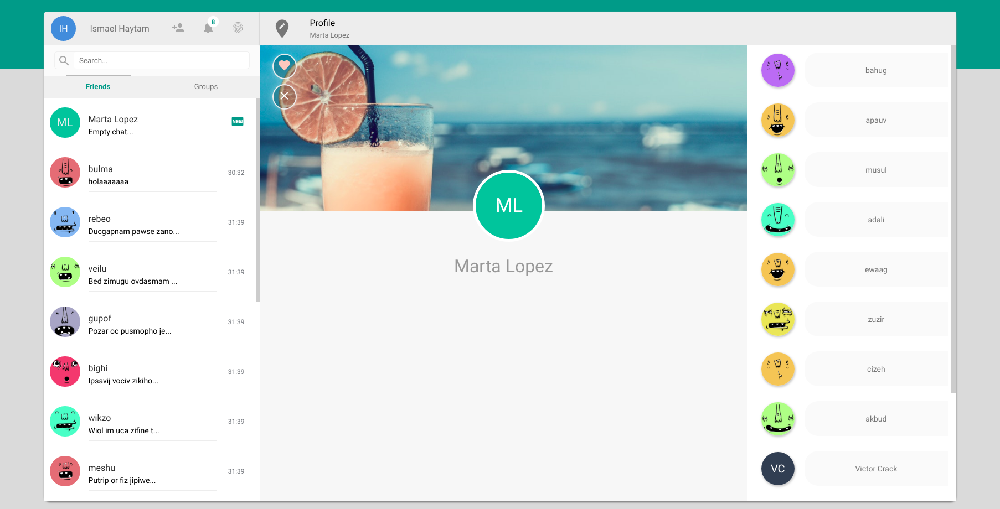
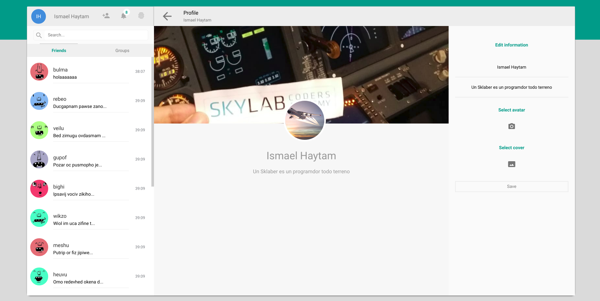
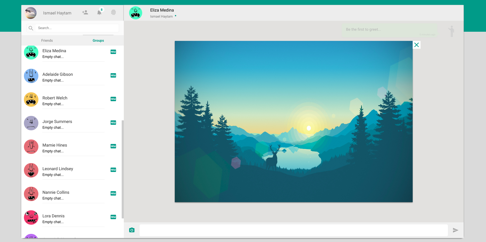

# SkyChat

SkyChat Messenger is a free messaging service. The application allows to send text messages, images and other media and documents, and in the near future calls and audio. The application is made for desktop computers and can also be accessed from the mobile device. Originally, users only communicate with each other individually or in groups of individual users. The app  also allows the user to search for friends and send friend requests.

Live demo [https://skyChat.surge.sh/](https://skyChat.surge.sh/)

View the [Documentation](./docs/README.md)

## Screenshoot







# Getting Started

## Adonis API application (Server)

This is the boilerplate for creating an API server in AdonisJs, it comes pre-configured with.

1. Bodyparser
2. Authentication
3. CORS
4. Lucid ORM
5. Migrations and seeds

### `Setup`

Use the adonis command to run server in dev mode.

```js
npm install 
&&
adonis serve --dev
```


### `Migrations`

Run the following command to run startup migrations.

```js
adonis migration:run
```

### `Seeders`

Run the following command to run Seeders.

```js
adonis seed
```

### `Tests`

Run the following command to run Tests.

```js
adonis test
```


## React (Client)

```bash
npm install 
&&
adonis serve --dev
```

### `Setup`

```bash
npm install 
&&
npm run start
```

Runs the app in the development mode.<br>
Open [http://localhost:3000](http://localhost:3000) to view it in the browser.

## Learn More

You can learn more in the [Create React App documentation](https://facebook.github.io/create-react-app/docs/getting-started).

To learn React, check out the [React documentation](https://reactjs.org/).


## Author

- Ismael Haytam Tanane [Git - Arcoders](https://github.com/arcoders)

