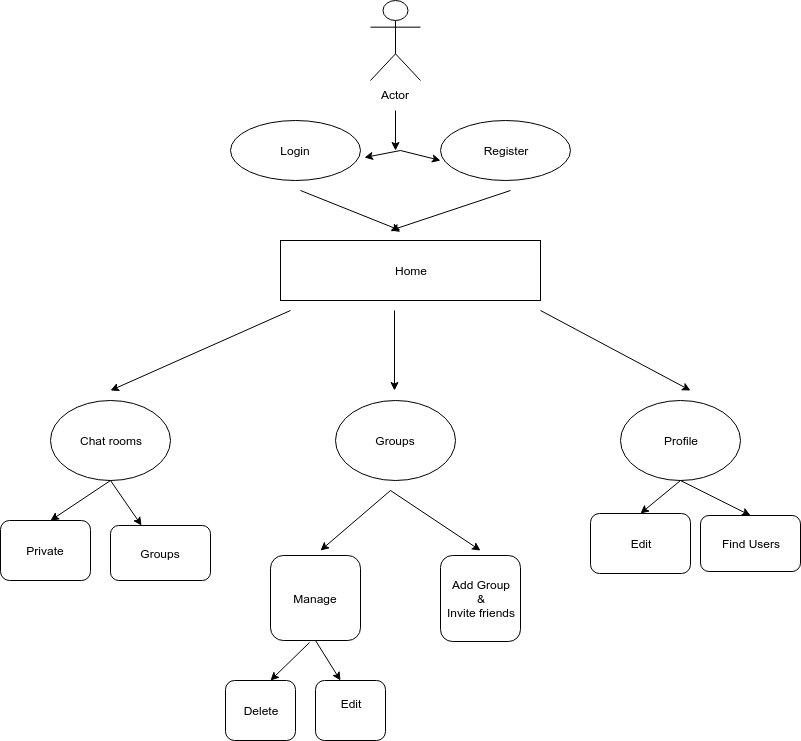
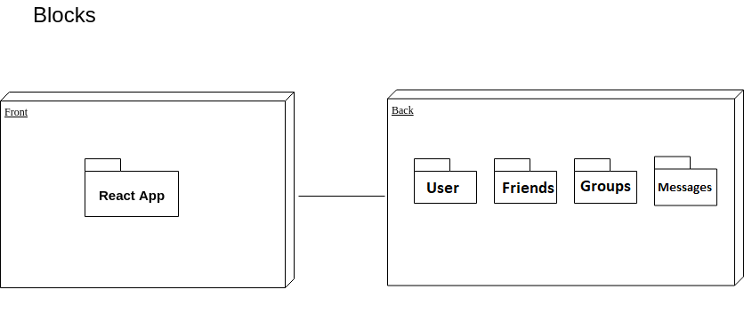
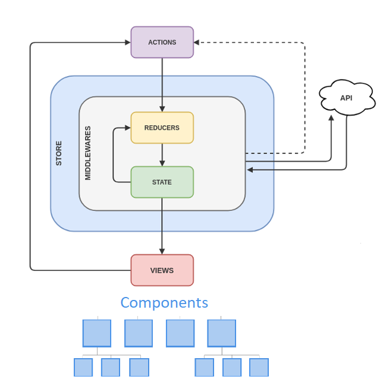
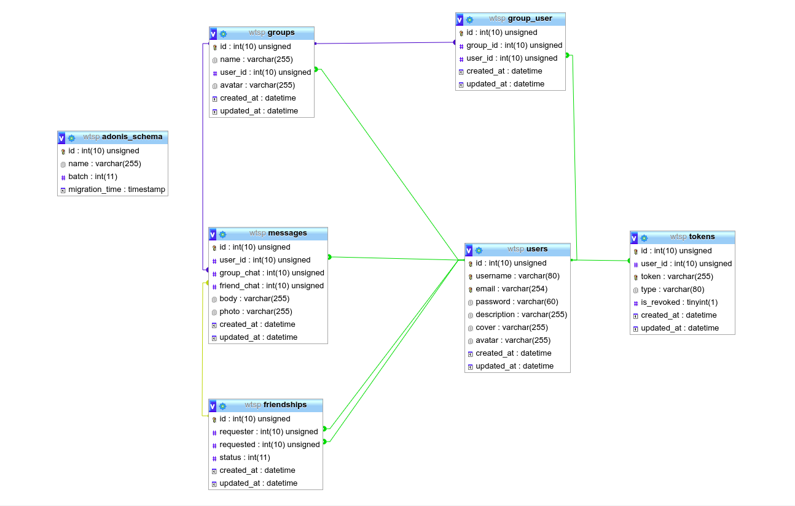
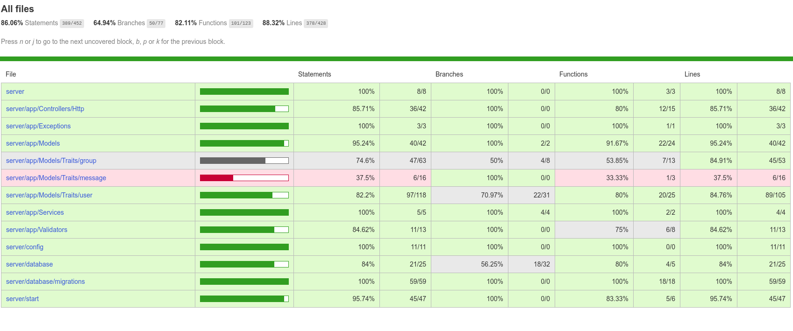

# SkyChat

## Introduction

SkyChat Messenger is a free messaging service. The application allows to send text messages, images and other media and documents, and in the near future calls and audio. The application is made for desktop computers and can also be accessed from the mobile device. Originally, users only communicate with each other individually or in groups of individual users. The app  also allows the user to search for friends and send friend requests.

## Use cases diagram

## Block diagram

## Components Diagram

## Data model

## Testing

## Technology Stack

* PUG
* SASS
* Javascript (ES6)
* React/Redux
* Adonis
* MYSQL
* BDD JAPA

